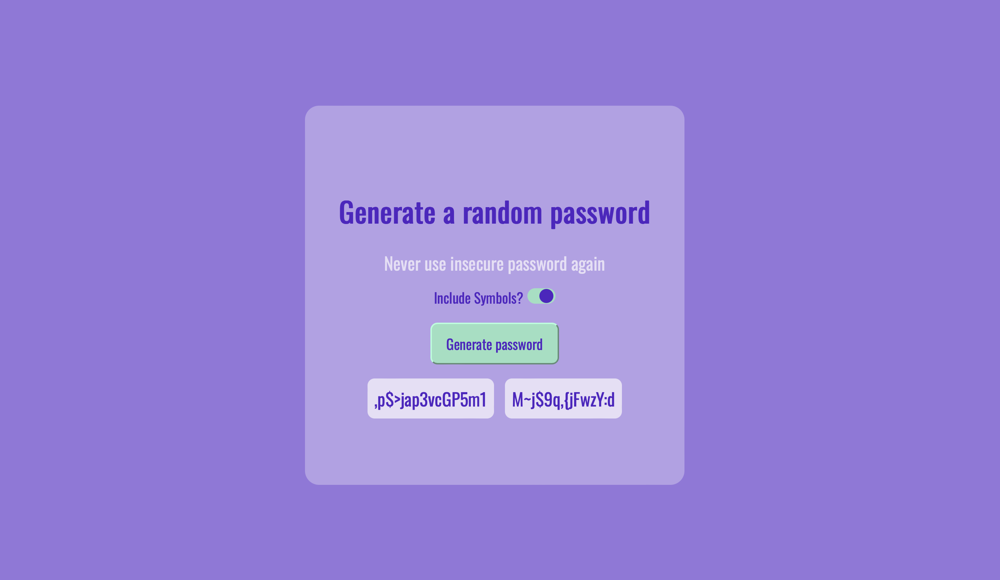

# Password Generator

## Overview

This simple web application generates random passwords based on user-selected criteria. It's built with modern web technologies and is designed to be user-friendly.

## Features

- Generate random passwords with ease.
- Option to include symbols for added security.
- User-friendly interface.

## Screenshot

## How to Use

Visit the application's web page by clicking on the 'index.html' file and simply click on the "Generate password" button. If you require symbols in your password, toggle the "Include Symbols?" switch.

## Installation

No installation necessary! Just open the application in your web browser.

## Technology Stack

- HTML
- CSS
- JavaScript

## Contributing

Pull requests are welcome. For major changes, please open an issue first to discuss what you would like to change.

## License

This project is open source and available under the [MIT License](LICENSE).